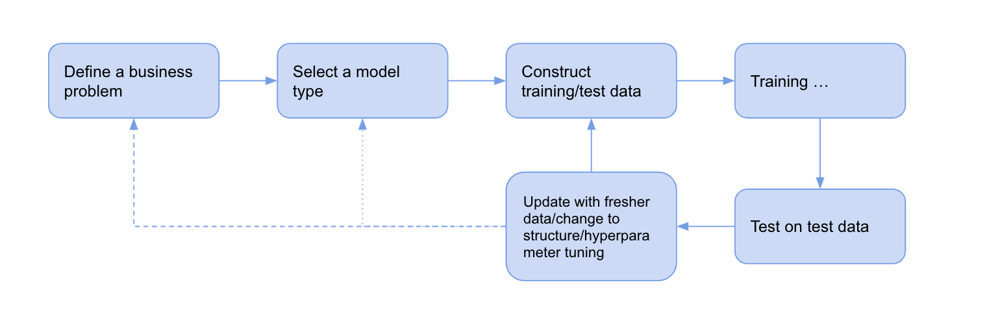

# Learn Like A Machine

I’m a machine learning engineer. I build models to solve real-world problems and improve their performance continuously. As anyone in this domain may be familiar with, a typical model training process works like this:

Sometimes the improvement comes from a breakthrough change in the structure. Sometimes, tuning parameters works wonders. Sometimes, if I’m lucky enough, I can possibly level up the performance by just using fresher data. The process isn’t always fun, and nine times out of ten, I got nothing out of my relentless effort. But just because of this, I enjoy the moment when seeing things working out, if only a little improved.

We’ve always been hoping that machines could be as intelligent as human beings. However, my experience with ML models got me to feel that things can happen in mutual ways. Think about our abstracted learning loop and how it resembles an ML learning process - we practice, see the outcome, and make changes accordingly. Sometimes we need to take a giant leap to grow ourselves, like getting into college, switching jobs, and sometimes, our better lives may simply come from an incremental but persistent change, like doing 20 min exercise every day.
Inspired by these similarities, I’d like to take a page from machine learning’s book to retrospect my 2020 and make resolutions for 2021 following the cornerstones. Learn like a machine and be performant, so to speak.

## Model

If I were to live my life in an ML world, I would behave like a Neural Net, not only for its human-brain-like structure but for common traits in other aspects. We roughly know some techniques would lead to satisfactory performance and have fortunately built some thumb rule to get those things right. Yet, we still feel overstretched in interpreting how they exactly work. Similarly, a gazillion theories are talking about the mechanisms of how people acquire knowledge in the real world, such as the learning cycle, fast learning techniques. However, rarely the case would people believe attributing any of our achievements merely to those factors does make sense.

The collision on the mysteriousness makes Neural Net a just-right fit. Besides, a neural network’s performance may be capped by its inherent structure despite all other efforts. You can imagine how helpless a neural net with no activation function would be at predicting non-linear relationships. Likewise, innate attributes like our talents may have mostly decided how far we could fare upon our birth.

Then what can I borrow from the ML world in this regard? At the very least, don’t waste energies on things I’m not good at but keep looking out for areas where my skills can be transferred into values. There are tons of articles on the topic, helping with recognizing real interests and talent. For myself, *I’ll think of all the moments when I felt content, desperate, or panic. Those are tangible things that clue in my strength, real interests, and what I’m just born to be not good at*.

- Things I failed →opportunity for improvement (weak indicator)
- Things I failed again and again, no matter how hard I tried to → consider reducing investment or even stop doing (medium)
- Things got me struggling, and yet I’d like to keep trying → real interests (strong)
- Things I felt satisfied with → strength (weak)

## Metrics
Measuring real life is a bit hard, and quantification can be even harder. But efforts would become disoriented with no metrics being around. Therefore, I look at some high-level metrics as a trade-off between having nothing to measure and having anything but inexecutable.

### Convergence
- Make steady improvement along the way. Incremental changes are preferred more than big leaps.
- There would be ups and downs. But eventually, my performance will reach a stable level of being great and even beyond.

### Things that I must achieve
- Deliver top line projects planned for H1 and H2. High quality over high quantity.
- Demonstrate creativity.
- Output knowledge. Help others.

### Wellbeing
- Keep fit. No illness. Keep taking dietary supplements.
- Expose to a manageable stress level. Stretch my comfort zone out but not yet devastating.
- Courageous rest, as in the book **_Peak Performance: Elevate Your Game, Avoid Burnout and Thrive with the New Science of Success_** advocates.

Chances are they may not always go in the same direction and sometimes contradict each other as any other metrics would. To address the conflicts, wellbeing is considered the primary metric, followed by the things that must be achieved metric.

## Hyperparameters/Settings
If the model structure isn’t going to be changed, these things promise some difference in our lives positively.
### Labels — feedback for each action
Arguably, labels are the most precious resource in ML model training as it tells how far each prediction is off the goal, which in turn enables the learning process. While models digest labels eagerly with no discrimination, people are sometimes having difficulties in receiving feedback. But if we take feedback as nothing but just a piece of information guiding us in the direction for improvement, we would be more open to feedback, and better performance would come along.

Feedback items can be categorized by their resources:

**Self-reflection**
**Work-related**
- Informal feedback from coworkers
- Formal review cycle
**Non-work related**
- Partner/kids
- Parents
- Friends

Although all feedback items contribute equally to the total loss, it doesn’t necessarily mean their impacts are equal in essence. Some feedback comes in more often than others, like self-reflection, and some feedback gets back to us sooner like those from our partners. The differences in delay and amount distinguish importance.

### Loss function
With labels, a loss function helps with qualifying the distance between model predictions and targets. Every loss function has its semantic meaning, e.g.
- MSE: All performance will be treated equally, which means some unusual lowlights may unnecessarily draw a lot of attention for their large contribution.
- Log loss: Widely applied in 0/1 binary classification for its mathematical merit. But is my life a binary classification problem? No can do. I would never model my life& work as a binary classification where results only have two values — success or failure.
- Huber loss: within the normal range, performance is considered equally, but outside of the range, performance contributes less to the loss, which means we think less about unusual performance as it could happen by chance.

### Learning rate and optimization method
They are the compass pointing in the direction where we should put in the effort to reduce loss. Assuming Adam is the optimization function, my investment’s magnitude would depend on how far I’ve been in the area and the inertia I’m having. That is to say, having patience is required for old places because the improvement is doomed to be incremental if not tiny. On the contrary, I should feel free to make bold progress in new areas. Groundbreaking changes are welcomed too. The Law of inertia suggests efforts will be continuous — today’s action is close to yesterday’s. Therefore, I’d better not assume any significant change would happen quickly. Reading 10 books per week from tomorrow, given I didn’t read anything in the past year? That will be the day!

### Batch size
The batch size is analogous to how often I look back and make the adjustment with the feedback I’ve collected.

#### Small batch
- I train myself very often, leading to timely changes but may expose myself to noises.
- I would be obsessed with minor details, like whom I met today, which sentence I shouldn’t have said, etc. EVERY single event matters in this mode.

#### Large batch
- I train myself after getting a sufficient amount of data.
- Too late feedback would help avoid less meaningful feedback but may miss some useful feedback.

#### My choice — depending on types.
- Weekly non-work-related and monthly for work-related
- Even lower for self-reflection: I’m not saying I dislike self-reflection. In fact, I tend to do it the other way round — I’ve been so obsessed with self-reflection in the past that sometimes I’m just bothered by myself. As such, I would benefit from reduced frequency.

## Bias and variance
The bias-and-variance trade-off is a problem universally existing in all machine learning algorithms. In a nutshell, a model with high bias does a great job at making stable predictions. They are close to each other but all far off the target. On the flip side, predictions from a high-variance model are scattered and sensitive to the training data. Bias and variance can be modeled in quite a simple way in the human world. For instance, if my study area is too narrow, I’ll be too good at a specific area and miss my overall goal. But if my study scope is too broad, I may lose my focus and never get to my target either.

Being a software engineer, I tend to deep into a specific domain rather than expose myself to too many areas, especially non-technical ones. To reduce such bias, I have to be really mindful of the issue and strategically plan out solutions.

- Diversify the source of knowledge to avoid absorbing essentially the same knowledge (like 100% technical and 0 literal and arts).
- Diversify learning ways to prevent fatigue, e.g., housework, tv drama. They are the best resources for inspiration.
- Diversify my idols: Who should I admire, and what should I learn from them? Keep in mind that every accomplished people has a unique background and opportunities. Making a complete emulation is completely impossible and meaningless.
- Diversify topics: If the data points are all about work and even only about work in a specific company/team, I may be overfitting as the knowledge is too thorough in generalizing to other parts of my life.

## Keep the Ball Rolling
Iterating!

Discussions above are all in supervised learning — I practice, I receive feedback, and I improve. However, things may not perfectly fit into this framework. For one thing, not all actions will have feedback or receive feedback in a timely fashion. For another, not all feedback is quantifiable. Such being the case, next time I’ll align learning experience in the real world to reinforcement learning, which is proven to be powerful under those limitations.

It’s just so enjoyable to reflect on myself using the analogy of ML model training. This article is also inspired by the book *Peak Performance: Elevate Your Game, Avoid Burnout and Thrive with the New Science of Success* written by [Brad Stulberg](https://twitter.com/BStulberg?ref_src=twsrc%5Egoogle%7Ctwcamp%5Eserp%7Ctwgr%5Eauthor)  and [Steve Magness](https://twitter.com/stevemagness?ref_src=twsrc%5Egoogle%7Ctwcamp%5Eserp%7Ctwgr%5Eauthor) . I’m grateful for getting to know their wonderful ideas on stress, rest, and purpose right at the beginning of the new year.

I’ve written too much and probably shouldn’t expect readers would follow to the end. But let me know if you do. Any feedback is appreciated!

(This article is also posted on https://chloecc-cc95.medium.com/learn-like-a-machine-be-performant-27ea74eddb1f)
